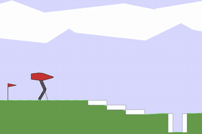
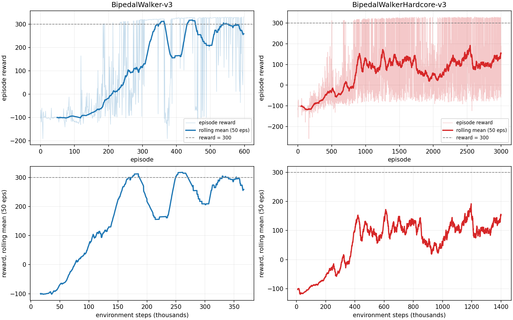

# Learning to Walk Efficiently

**A Truncated Quantile Critics (TQC) agent that learns to walk — and then run — in the BipedalWalker physics simulation, extended with an elite replay buffer and observation normalisation.**

Implemented from scratch in PyTorch (no Stable-Baselines) with **sample efficiency** as the objective: reaching a high score in as few environment steps as possible. The agent solves the standard course in ~168k environment steps and goes on to clear the much harder obstacle course below.

<p align="center">
  <br>
  <em>Trained agent on the hardcore course — episode 2200, reward 325.9</em>
</p>

---

## Results

Both environments are Gymnasium's `BipedalWalker-v3` and `BipedalWalkerHardcore-v3` (Box2D physics, 24-dim observation, 4-dim continuous action in `[-1, 1]`, 2000-step episode cap). The hardcore variant adds ladders, stumps and pits to the terrain.

> Gymnasium registers the standard course with a 1600-step limit; these runs used 2000 for both courses, so `make_walker()` sets that explicitly. 32 standard-course episodes in the logs run past 1600 steps, so the default limit would not reproduce them.



*Top: reward per episode. Bottom: the same rolling mean plotted against environment steps consumed — the sample-efficiency view.*

| | `BipedalWalker-v3` | `BipedalWalkerHardcore-v3` |
|---|---|---|
| Episodes trained | 599 | 3000 |
| Environment steps consumed | 367k | 1.40M |
| **Steps to a 50-episode mean of 300** | **168k** (episode 342) | not reached |
| First single episode above 300 | 63k steps (episode 184) | 249k steps (episode 503) |
| Best episode reward | 331.8 | 330.3 |
| Episodes scoring above 300 | 267 / 599 (45 %) | 470 / 3000 (16 %) |
| Peak 50-episode mean | 318.0 | 192.0 |
| Mean reward, last 100 episodes | 279.9 | 137.1 |

Every number above is computed from the episode logs in `results/logs/` by `scripts/plot_training_curves.py` — run it to verify them, no training required.

**Standard course:** solved. The agent first crosses 300 on a single episode after 63k environment steps, and holds a 50-episode mean above 300 from 168k steps onward. It learns to lean forward as it runs — a direct consequence of the forward-velocity bonus — and completes the course in under 11 seconds of simulated time once converged. It recovers on its own from the two dips visible around episodes 380 and 500, rather than getting stuck in the classic failure mode where the walker collapses into the splits and never recovers.

**Hardcore course:** partially solved, and honestly so. Scores stay low until around episode 1000, after which the agent completes the obstacle course regularly — 470 episodes in total, with a best score matching its standard-environment peak. But it never sustains that: the 50-episode mean peaks at 192. The gait it converges on is fast and risk-taking (encouraged by the forward-velocity bonus), which pays off on clean runs and falls hard on stumps and pits. That variance, not the ceiling, is the limitation of this run.

---

## Method

The agent is Soft Actor-Critic extended into the TQC framework, with two additions of my own (marked in bold).

| Component | Detail |
|---|---|
| Critics | 2 quantile critics × 25 quantiles, MLP 2×256 ReLU |
| Truncation | 2 quantiles dropped per critic, then element-wise `min` across critics — controls overestimation bias |
| Critic loss | Quantile Huber loss over the `τ` midpoints |
| Actor | Gaussian MLP 2×256, `tanh`-squashed with the log-prob correction term, reparameterised sampling |
| Entropy | Automatic temperature tuning against a target entropy of `−dim(A)` |
| Targets | Polyak averaging, `τ = 0.005` |
| **Observation normalisation** | Running mean/variance normaliser (Welford-style update) applied to every observation before the networks see it |
| **Elite replay buffer** | A second 10k-transition buffer holding whole trajectories from episodes above the 90th reward percentile; each training batch is 25 % elite, 75 % uniform |
| Reward shaping | Small forward-velocity bonus, `0.1 × Δx`, to discourage standing still |

### Networks

Each critic is a feedforward MLP with two hidden layers of 256 units and ReLU activations, mapping the concatenated state–action pair to `M = 25` quantiles of the return distribution.

The actor is a Gaussian MLP of the same shape, outputting a mean `μ(s) ∈ ℝ⁴` and a log standard deviation `log σ(s) ∈ ℝ⁴` (clamped to `[−20, 2]`). Actions are sampled with the reparameterisation trick and squashed into the environment's `[−1, 1]⁴` action bounds:

```
a = tanh(μ(s) + σ(s) · ε),    ε ~ N(0, I)
```

Because the `tanh` changes the density, the log-probability carries the standard squashing correction:

```
log π(a|s) = log N(z; μ, σ²) − Σᵢ log(1 − tanh²(zᵢ))
```

This keeps the policy stochastic *and* differentiable, which is what the entropy-regularised policy gradient needs.

### Training

Training is off-policy from a replay buffer `D` of transitions `(sₜ, aₜ, rₜ, sₜ₊₁)`.

**Critic update.** Each of the `N` critics predicts `M` quantiles. The lowest `k` quantiles of each sorted critic output are dropped, the critics are combined with an element-wise `min`, and the mean of the surviving quantiles forms the bootstrap target. The critic loss is the quantile Huber loss

```
L_critic = (1 / kNM) Σᵢ Σⱼ ρ_τ(yᵢ − θⱼ)
```

where `ρ_τ` is the quantile Huber loss and the `τ` values are the `M` midpoints of the unit interval.

**Actor update.** The actor maximises expected return plus entropy:

```
L_π = E_{s~D} [ α log π(a|s) − Q(s, a) ]
```

with `Q(s, a)` the element-wise minimum across critics.

**Entropy tuning.** The temperature `α` is tuned automatically by minimising

```
L_α = E_{a~π} [ α · (−log π(a|s) − H_target) ]
```

against a target entropy `H_target = −dim(A) = −4`, which keeps exploration alive without hand-scheduling `α`.

**Target networks.** Critic targets follow Polyak averaging, `ψ_target ← τψ + (1 − τ)ψ_target` with `τ = 0.005`.

### Exploration

Exploration comes primarily from the stochastic Gaussian policy itself — a sample `z ~ N(μ(s), σ²(s))` passed through `tanh`. On top of that, actions early in training are effectively random, which populates the replay buffer with broad state-space coverage before policy-driven actions dominate. This matters here: most of the earlier architectures I tried got stuck in local optima (the standing-still and splits gaits) without it.

### Hyperparameters

| Parameter | Value |
|---|---|
| Learning rate (actor, critics, `α`) | `3e-4` |
| Batch size | 256 |
| Replay buffer size | `1e6` |
| Elite buffer size / batch share | `1e4` / 25 % |
| Discount `γ` | 0.99 |
| Soft target coefficient `τ` | 0.005 |
| Initial entropy coefficient `α` | 0.2 (auto-tuned) |
| Critics `N` / quantiles per critic `M` | 2 / 25 |
| Quantiles dropped per critic | 2 |
| Episode cap | 2000 steps |

I first ran a 50-trial Optuna search (Bayesian optimisation over the learning rate, batch size and entropy coefficient), but with a compute budget that limited each trial to 100 episodes the results were not informative — 100 episodes is well before this agent separates good configurations from bad ones. The final values came from manual tuning and the literature instead.

### How I got here

Four algorithms were tried before settling on TQC:

- **TD3** was stable and avoided divergence, but converged too slowly to be practical under a sample-efficiency objective.
- **SAC** was a much better fit — the entropy-regularised stochastic policy explores well, and it reliably reached 300+ on the standard environment in 300–400 episodes. It then plateaued, with further improvement coming only at a real cost in stability.
- **SAC + D2RL** (dense skip connections into every layer) was an attempt to use wider networks without vanishing gradients. It destabilised training in both the standard and hardcore settings.
- **SAC + D2RL + ERE** (Emphasizing Recent Experience) was meant to accelerate convergence by prioritising recent transitions. Because D2RL had already made training sensitive, over-weighting recent noisy transitions made things worse, not better.

**TQC** was the configuration that handled the overestimation bias well enough to make the hardcore environment tractable at all, and it is what the numbers above come from.

---

## Repository layout

```
.
├── notebooks/
│   └── tqc_bipedal_walker.ipynb        # full implementation + training loop
├── src/
│   └── walker_utils.py                 # env construction, video/log recording, live plotting
├── scripts/
│   └── plot_training_curves.py         # regenerates results/figures from the logs
├── results/
│   ├── figures/training-curves.png
│   ├── logs/                           # per-episode reward and length, both runs
│   └── videos/hardcore-demo.gif        # rendered rollout of the trained agent
├── requirements.txt
└── LICENSE
```

Raw `.mp4` rollouts and the per-run `videos-*/` and `logs-*/` folders written by the recorder are git-ignored; the GIF and the logs above are the versioned versions of those artefacts.

---

## Running it

```bash
python -m venv .venv && source .venv/bin/activate
pip install -r requirements.txt
jupyter lab notebooks/tqc_bipedal_walker.ipynb
```

`gymnasium[box2d]` needs a working `swig` and C toolchain; on macOS `brew install swig` first.

The notebook is configured for the hardcore environment — pass `hardcore=False` to `wu.make_walker(...)` for the standard one. The hardcore run is 3000 episodes and takes several hours; the Box2D simulation is the bottleneck rather than the network, so a GPU buys less here than the model size suggests.

To regenerate the plots from the committed logs (no training or GPU needed):

```bash
python scripts/plot_training_curves.py
```

---

## Limitations and next steps

- **Two critics, not five.** Standard TQC uses an ensemble of five; two weakens the truncation and leaves some overestimation on the table. This was a compute constraint, not a design choice.
- **The truncation step is not faithful to the paper.** Quantiles are truncated per critic rather than pooled across the ensemble first, and the current implementation drops the *lowest* two quantiles of each sorted critic output instead of the topmost ones, so it is not removing the overestimated tail as TQC intends. Fixing this is the single highest-value change to make, and the most likely cause of the hardcore variance.
- **Hyperparameter search was truncated.** 50 Optuna trials at 100 episodes each were too short to be informative, so the final values came from manual tuning and the literature.
- **Early exploration is inefficient.** Even on the standard course the agent spends a large number of episodes before the reward curve lifts off.
- Next: a proper long-horizon search (1000-episode trials, 100+ of them), the full five-critic ensemble with pooled truncation, and noisy-network exploration in place of pure Gaussian sampling.

---

## References

1. Kuznetsov et al., *Controlling Overestimation Bias with Truncated Mixture of Continuous Distributional Quantile Critics*, ICML 2020. [PMLR v119](https://proceedings.mlr.press/v119/kuznetsov20a.html)
2. Haarnoja et al., *Soft Actor-Critic: Off-Policy Maximum Entropy Deep RL with a Stochastic Actor*, [arXiv:1801.01290](https://arxiv.org/abs/1801.01290).
3. Fujimoto et al., *Addressing Function Approximation Error in Actor-Critic Methods* (TD3), ICML 2018. [PMLR v80](https://proceedings.mlr.press/v80/fujimoto18a.html)
4. Sinha et al., *D2RL: Deep Dense Architectures in Reinforcement Learning*, [arXiv:2010.09163](https://arxiv.org/abs/2010.09163).
5. Wang and Ross, *Boosting Soft Actor-Critic: Emphasizing Recent Experience without Forgetting the Past*, [arXiv:1906.04009](https://arxiv.org/abs/1906.04009).
6. Popov et al., *Data-efficient Deep Reinforcement Learning for Dexterous Manipulation* (velocity-bonus shaping), [arXiv:1704.03073](https://arxiv.org/abs/1704.03073).

Reference implementations consulted while writing the agent: [SamsungLabs/tqc_pytorch](https://github.com/SamsungLabs/tqc_pytorch), [SB3-Contrib's TQC](https://sb3-contrib.readthedocs.io/en/master/modules/tqc.html), and the running mean/variance normaliser from [OpenAI Baselines](https://github.com/openai/baselines/blob/master/baselines/common/running_mean_std.py). The agent itself — networks, TQC update, elite buffer, normaliser — and all experiments are my own.

---

## License

[MIT](LICENSE) — free to use, modify and distribute with attribution.
